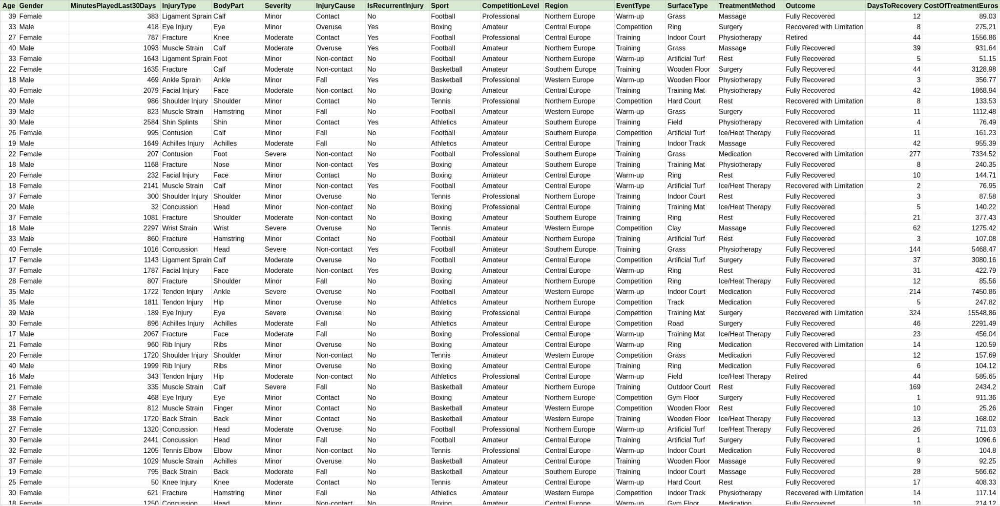
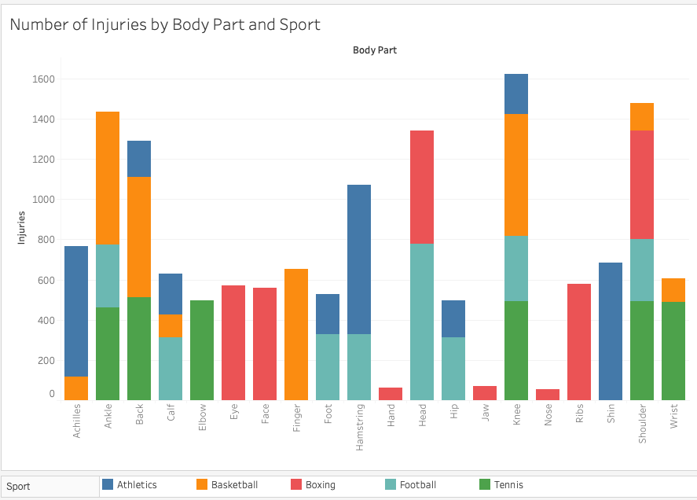

# Sports Injury Recovery Prediction Tool

**CS 4243 Machine Learning Final Project**

Joshua Bearfield, Femke Jansen, Carter Moore, Fiona Pendergast, Katherine Tse

## Project Summary
A machine learning project that predicts optimal treatment methods and recovery timelines for various sports injuries. This tool combines two regression models to provide recovery insights for athletes and medical professionals.

## Models
### Logistic Regression
**Purpose:** Predict the probability of full recovery for different treatment methods

**Implementation:** 
* Binomial logistic regression model that evaluates treatment effectiveness
* Iterates through available treatment options to identify those with highest probability of full recovery
* Replaced initial decision tree approach to avoid bias toward most common treatments


### Linear Regression
**Purpose:** Estimate recovery duration in days for given recovery method

**Implementation:** 
* Stochastic Gradient Descent (SGD) via Sklearn's SGDRegressor
* Standardized numerical features using StandardScaler
* Categorical features encoded with LabelEncoder

## Dataset
The dataset originated from a multi-tab spreadsheet containing sports injury records across multiple variables. Using pandas, we performed data consolidation by joining tables on primary keys and selecting relevant features for our predictive models.



**Features Selected:**
| Category| Features |
|---|---|
|Athlete-Specific| Age, Gender, Minutes played in last 30 days|
|Injury-Related| Injury type, Body part affected, Severity (Minor/Moderate/Severe), Cause, Recurrence status|
|Event-Level| Sport, Competition level, Region, Event type, Surface type|
|Target Variables| Treatment method, Days to recover, Cost of recovery| 

### Dataset Characteristics

**Total Records:** ~15,000 samples

**Severity Distribution:**
* Minor: 50%
* Moderate: 35%
* Severe: 15%

**Distribution:** Most features (surface type, sport, age, treatment method, injury cause, event type) are evenly distributed

**Sport-Specific Patterns:** Certain injuries are exclusive to specific sports (e.g., nose, jaw, face injuries predominantly in boxing)



## Technologies Used
* Python
* Scikit-learn
    * Logistic Regression
    * SGDRegressor
    * GridSearchCV
    * StandardScalar
    * LabelEncoder 

## Results 
TODO

## Installation & Usage

```bash
# Clone repository
git clone [your-repo-url]

# Install dependencies
pip install -r requirements.txt

# Run the models
python main.py
```

## Contributors
| Name | Major | Grad Year |
| --- | --- | --- |
| Joshua Bearfield | Computer Science | 2027 |
| Femke Jansen | Computer Science | 2027 |
| Carter Moore | Computer Science | 2026 |
| Fiona Pendergast | Computer Science + Robotics Engineering | 2026 |
| Katherine Tse | Computer Science + Interactive Media and Game Development | 2026 |

## Course Information
Worcester Polytechnic Institute

CS 4243 Machine Learning A-Term 2025

Professor Kyumin Lee


## Acknowledgements
**Dataset:** Our dataset was created by FP20 for a data analysis challenge linked below.
* [Dataset Spreadsheet Link](https://docs.google.com/spreadsheets/d/1e0OpTErDDSlV1JxID5GKURyCzn71U0mm/edit?gid=1125320447#gid=112532044)
* [Data Analysis Challenge Information Link](https://docs.google.com/document/d/1DAs8Ayw6lrxyyJC42ry_F-mKwwsDg9vL/edit)